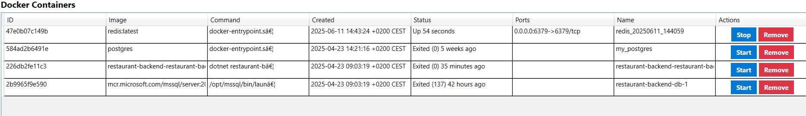
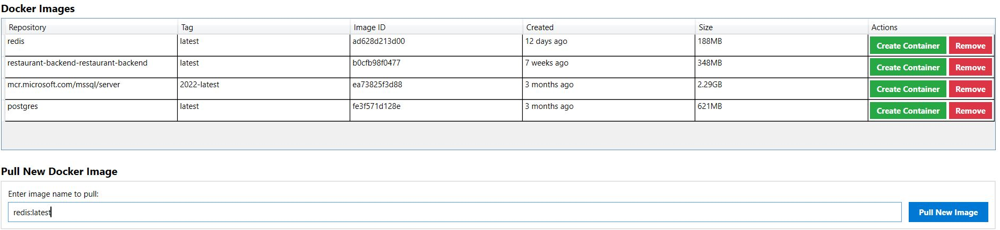

# Docky - Docker Container Manager (Desktop GUI)

**Docky** is a desktop application built with WPF (Windows Presentation Foundation) that allows you to visually manage Docker containers and images.

---

## 🚀 Features

- 🔍 List running and stopped containers
- 📦 View Docker images
- ▶️ Start and stop containers
- ➕ Create new containers with advanced options:
  - **Ports**: Map host and container ports (e.g., `8080:80`)
  - **Environment variables**: Set environment variables inside the container (e.g., `ENV=production`)
  - **Volumes**: Mount host directories or files into the container (e.g., `/host:/container`)
  - **Extra parameters**: Any additional `docker run` flags (e.g., `--network my-network`)
  - **Detached**: Run the container in the background (`-d`)
  - **Interactive**: Run with interactive terminal (`-it`)
  - **Auto-remove**: Remove the container automatically when it exits (`--rm`)
- ⏬ Pull new images from Docker Hub
- ❌ Remove Docker images
- 🗑 Remove containers

---

## 🖥️ UI Overview

- **Containers Section:** Displays a table of existing containers with actions (Start / Stop / Remove)

  
- **Images Section:** Shows all available images with options to create containers or remove images
- **Pull Image:** Pull a new Docker image by name

  
- **Create Container:** Fill out a form to create a container with detailed configuration options

  

---

## 🧱 Tech Stack

- .NET (WPF)
  
---

## ⚙️ Requirements

- Docker desktop installed and running

---

## 📦 Run Locally
 
   ```bash
   git clone https://github.com/your-username/Docky-Desktop.git
   cd Docky.Desktop
   dotnet run --project Docky.Desktop
  ```

---

## 📌 Future Improvements
- Real-time container logs
- Container exec (shell access)
- Network and volume management
- Light/Dark theme switcher


